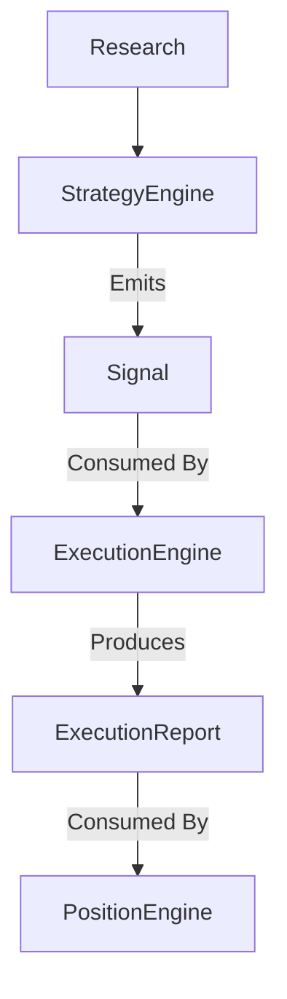

# ExecutionReport Specification

## 1. Purpose

The `ExecutionReport` is the strict runtime contract produced **only** by the Execution Engine. It represents the actual, physical outcome of attempting to execute a `Signal` in the market (whether simulated or live).

In the APEX Quant Research Framework:
- `Signal` represents pure **intent**.
- `ExecutionReport` represents strict **reality**.

An `ExecutionReport` must never contain strategy logic, intent, or theoretical derivations. It is exclusively an empirical record of an execution event.

---

## 2. Architecture

The `ExecutionReport` serves as the bridge between market execution and portfolio positioning. It acts as the **only** input accepted by the Position Engine.

Because the Position Engine only accepts `ExecutionReports`, it remains entirely decoupled from the original Strategy. It does not care *why* an order was placed; it only cares that an execution physically occurred and the portfolio inventory must change.

---

## 3. ExecutionReport Object Architecture

The `ExecutionReport` object structures the physical facts of the trade into logical sections:

### 3.1 Identity
- `execution_id`: Unique cryptographic identifier for this specific execution event.
- `signal_id`: Reference back to the `Signal` that triggered this execution attempt.
- `timestamp`: The exact timestamp when the Execution Engine generated this report.
- `strategy_name`: Inherited identifier for tracing the source of the execution flow.

### 3.2 Execution Status
The terminal or intermediate state of the execution attempt:
- `FILLED`: The order was completely filled.
- `PARTIALLY_FILLED`: Only a portion of the requested quantity was filled.
- `REJECTED`: The broker/exchange rejected the order (e.g., invalid parameters).
- `EXPIRED`: The order timed out (e.g., Day Order or GTD) before it could be filled.
- `CANCELLED`: The order was successfully cancelled before execution.

### 3.3 Fill Information
- `requested_entry_price`: The theoretical entry price passed via the `Signal`.
- `actual_fill_price`: The exact price at which the asset was acquired or sold.
- `filled_quantity`: The amount of volume actually transacted.
- `remaining_quantity`: Volume left unfilled (relevant for partial fills).
- `fill_time`: The exact timestamp the execution occurred at the exchange/broker.

### 3.4 Execution Costs
- `spread`: The bid-ask spread encountered at the moment of execution.
- `slippage`: The difference between `requested_entry_price` and `actual_fill_price`.
- `commission`: Total commissions paid to the broker/exchange.
- `swap`: Overnight financing fees applied (if applicable at time of execution).
- `fees`: Any additional regulatory or exchange fees.

### 3.5 Quality
- `fill_quality`: Heuristic assessment of how optimal the fill was relative to available liquidity.
- `price_improvement`: Any positive slippage gained during execution.
- `execution_latency`: Delay (in ms) between signal emission and actual fill.
- `execution_score`: An aggregate metric scoring the efficiency of this specific execution.

### 3.6 Broker Information (Optional)
- `order_type`: The literal order type transmitted to the broker (e.g., `LIMIT`, `MARKET`).
- `broker_reference`: The internal ID assigned by the physical broker/exchange.
- `exchange_reference`: The transaction ID on the exchange level.

---

## 4. Rules and Anti-Patterns

An `ExecutionReport` is strictly a record of a momentary transaction. It must **NEVER** contain:
- **PnL**: Profit and Loss is a lifecycle metric calculated by the Position Engine over time.
- **Drawdown**
- **Trade Duration**
- **Portfolio Statistics**
- **Research Conclusions**
- **Strategy Logic**
- **Future Information** (Look-ahead bias)

---

## 5. Responsibilities

- **Ownership:** The Execution Engine is the sole owner and creator of the `ExecutionReport`.
- **Strategy Engine:** May never modify it (and should not directly read it, as Strategy only reads `TradingContext`).
- **Position Engine:** Consumes it strictly to update portfolio inventory and lifecycle states.
- **Portfolio Engine:** May never modify it.
- **Analytics:** May read historical `ExecutionReports` for transaction cost analysis (TCA).
- **Research:** Consumes large datasets of historical `ExecutionReports` strictly for post-trade analysis and modeling slippage/latency environments.

---

## 6. Design Principles

The `ExecutionReport` adheres to the following principles:
- **Immutable:** Once generated, it cannot be altered. It is a factual historical record.
- **Deterministic:** Given the exact same order and same tick data, the Simulator must produce the exact same report.
- **Singular:** Represents only one execution attempt. (A complex algorithmic order might generate dozens of partial fill `ExecutionReports`).
- **No look-ahead information:** Represents only facts known precisely at the `fill_time`.
- **Broker-independent:** Uses a unified structure regardless of the underlying execution venue.
- **Simulation-independent:** Structurally identical whether generated by a backtester or a live trading engine.

---

## 7. Future Extensibility

The greatest strength of the `ExecutionReport` contract is its venue-agnostic design. 

Because all downstream systems (Position Engine, Analytics, Portfolio Manager) only speak "ExecutionReport", the APEX framework can execute anywhere:
- **MT5 (Forex/Metals):** The MT5 Terminal's `OnTradeTransaction` events map their properties into the `ExecutionReport` structure.
- **Interactive Brokers (Equities):** IB's Execution Details map perfectly to the same fields.
- **Binance/Crypto Exchanges:** REST/Websocket JSON fill payloads are parsed into identical `ExecutionReports`.
- **Paper Trading:** A mock broker backend generates these reports to simulate forward testing.
- **Historical Simulation:** The Backtest Execution Simulator generates these by comparing Signals against historical tick data.

Downstream systems do not need to know *where* the trade was executed, only *that* it was executed.

---

## 8. Conclusion

The `ExecutionReport` becomes the permanent, incontrovertible audit trail between the Strategy's intent and the Position Manager's inventory. By completely isolating the act of execution from the lifecycle of a trade, APEX achieves an institutional-grade separation of concerns that ensures identical behavior in both simulation and live deployment environments.
