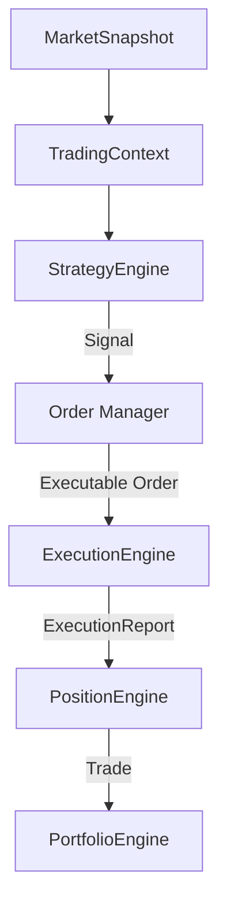

# Order Manager Specification

## 1. Mission

The Order Manager (OMS) owns the complete lifecycle of all pending orders. It sits directly between the Strategy Engine and the Execution Engine. 

Its primary mission is to manage order state until an order becomes executable, filling the structural gap between strategic intent (`Signal`) and physical transaction (`ExecutionReport`).

---

## 2. Architecture

With the introduction of the OMS, the official Simulation pipeline becomes:

### Why the OMS is required
A `Signal` represents pure intent (e.g., "Buy 10 lots if price drops to 1900"). If the current price is 1950, this intent cannot be resolved immediately. Without an OMS, the system would lose track of this resting condition.

### Why Execution Engine should never own pending orders
The Execution Engine's only job is to model the physical constraints of reality (spread, slippage, commission, latency). If it also held pending orders, it would become stateful and complex, violating the single responsibility principle. By removing order tracking from Execution, we allow the Execution Engine to be perfectly memory-less and instantaneously evaluative.

---

## 3. Responsibilities

The OMS is strictly responsible for:
- **Receiving Signals:** Translating intent into internally tracked Orders.
- **Creating Orders:** Generating stateful Order objects from Signals.
- **Maintaining Pending Orders:** Holding resting orders (LIMIT, STOP) in memory.
- **Tracking Order State:** Managing transitions through the order lifecycle.
- **Order Expiration:** Canceling orders based on Time-in-Force (e.g., GTC, GTD, IOC).
- **Order Cancellation:** Processing explicit cancel requests from the Strategy.
- **Triggering Stop Orders:** Evaluating current price to activate Stop orders.
- **Activating Limit Orders:** Evaluating current price to activate Limit orders.
- **Submitting Executable Orders:** Routing orders to the Execution Engine once conditions are met.
- **Maintaining Deterministic History:** Keeping an audit log of all order lifecycle events.

---

## 4. Non-Responsibilities

The OMS must **NEVER**:
- Simulate slippage or spread.
- Calculate commissions.
- Calculate PnL.
- Manage trades or open positions.
- Manage the portfolio.
- Perform analytics or research.
- Generate trading signals.

---

## 5. Order States

The OMS manages a strict state machine for every order.

### Lifecycle States
- `NEW`: Order generated from Signal, validating parameters.
- `PENDING`: Order is resting, waiting for price conditions (Limit/Stop).
- `ACTIVE`: Order is triggered/marketable and sent to Execution.
- `PARTIALLY_FILLED`: Order was partially executed; remainder may return to PENDING/ACTIVE.
- `FILLED`: Order completely executed. Terminal state.
- `CANCELLED`: Order aborted by the Strategy. Terminal state.
- `EXPIRED`: Order aborted by Time-in-Force rules. Terminal state.
- `REJECTED`: Order invalid (e.g., bad parameters, insufficient margin). Terminal state.

### State Transitions
- `NEW` ➔ `PENDING` (Limit/Stop orders) or `ACTIVE` (Market orders).
- `PENDING` ➔ `ACTIVE` (Trigger condition met), `CANCELLED`, or `EXPIRED`.
- `ACTIVE` ➔ `FILLED`, `PARTIALLY_FILLED`, or `REJECTED`.

---

## 6. Order Types

The OMS natively supports institutional-grade order types:
- `MARKET`: Executes immediately at the best available price.
- `LIMIT`: Rests until the asset can be bought/sold at the specified price or better.
- `STOP`: Rests until the trigger price is breached, then becomes a `MARKET` order.
- `STOP_LIMIT`: Rests until breached, then becomes a `LIMIT` order.

### Future Extensibility
The object-oriented design of the OMS state machine trivially supports future extensions like `MIT` (Market If Touched) or `TRAILING_STOP` without altering downstream or upstream contracts.

---

## 7. Input and Output

### Input
The OMS accepts only two inputs:
- `Signal`: The strategy's intent.
- `TradingContext`: Used strictly for trigger evaluation (e.g., checking `current_price` against Limit thresholds).

### Output
The OMS produces three distinct outputs:
- **Executable Orders:** The payload sent to the Execution Engine once a pending order becomes marketable.
- **Execution Requests:** Instructions to external brokers (in live deployment).
- **Historical Order Records:** The log of all states and transitions.

**Distinction:** An Executable Order is an internal payload handed down the pipeline. A Historical Order Record is an immutable artifact saved for transaction cost analysis (TCA) and research.

---

## 8. Cancellation Design

To allow strategies to cancel pending orders, the APEX framework adopts the **Cancel Intent** design pattern.

### Official Design: Signal-based Modification
The `Signal` object supports `CANCEL` and `MODIFY` as explicit directions (alongside `LONG` and `SHORT`). 

When a Strategy wishes to cancel an order, it emits a new `Signal` where:
- `direction = CANCEL`
- `reference_id = <original_signal_id>`

### Trade-offs
- **Alternative:** Direct API call (`oms.cancel(order_id)`). 
- **Why APEX rejects it:** Direct method calls re-introduce coupling. By forcing cancellation through the standard `Signal` contract, the Strategy remains purely functional (state-in, intent-out), making RL, ML, and paper-trading mathematically identical to live trading.

---

## 9. Immutability 

Immutability ensures cryptographic reproducibility:
- **`Signal` is immutable.** It represents a fixed moment of intent.
- **`ExecutionReport` is immutable.** It represents a fixed physical event.
- **OMS owns the mutable `Order` state.** The Order is a living object managed exclusively by the OMS. Strategy never mutates it. Execution never mutates it. When an Order reaches a terminal state, it becomes immutable and is archived.

This strict separation prevents side-effects and race conditions across the pipeline.

---

## 10. Failure Handling

Following the Doctor framework philosophy:
- An OMS failure (e.g., crashing on a malformed Signal) **must not corrupt** the Execution Engine, active Trades, or Portfolio.
- The OMS must log the failure, transition the malformed order to `REJECTED`, isolate the stack trace, and safely advance the simulation loop.

---

## 11. Design Principles

The OMS adheres strictly to:
- **Deterministic:** Same signals + same ticks = identical order state transitions.
- **Replayable:** Completely stateless between runs.
- **Broker-independent:** Evaluates price logic purely theoretically.
- **Simulation-independent:** Behaves identical in backtest vs. live.
- **Strategy-independent:** Agnostic to why an order was placed.
- **No optimization logic.**
- **No trading edge.**

---

## 12. Future Extensibility

The OMS acts as a universal buffer. It effortlessly supports diverse execution venues without architectural changes:
- **MT5 / Interactive Brokers / Binance:** In live trading, the OMS `ACTIVE` state corresponds to transmitting the API request. `PENDING` means it hasn't fired yet, or it's resting on the exchange's L2 book.
- **Paper Trading / Historical Replay:** The OMS triggers `ACTIVE` based on simulated ticks. 

Because the Strategy only emits intent, and the Execution Engine only handles physical fills, the OMS smoothly manages the temporal delay regardless of the deployment environment.

---

## 13. Conclusion

The Order Manager solves a critical architectural gap by becoming the authoritative owner of every order *before* it executes. By formally defining the lifecycle of resting intent, APEX completely decouples the temporal constraints of price conditions from both Strategy decision-making and physical market Execution, cementing a truly institutional-grade pipeline.
