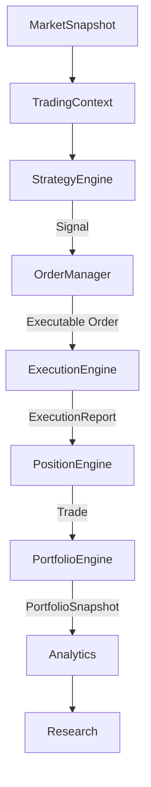

# PortfolioSnapshot Specification

## 1. Mission

The `PortfolioSnapshot` represents the complete account state at one specific point in simulated time. 

- `PortfolioSnapshot` is **NOT** the Portfolio Engine.
- It is a deterministic snapshot generated *by* the Portfolio Engine.

---

## 2. Contents

### Suggested Fields
- `timestamp`: The exact simulated time this snapshot was taken.
- `equity`: Total account value (Balance + Floating PnL).
- `balance`: Realized account value (closed trades only).
- `floating_pnl`: Unrealized PnL from open positions.
- `closed_pnl`: Cumulative realized PnL.
- `drawdown`: Current equity drawdown from `peak_equity`.
- `peak_equity`: The highest equity point achieved so far.
- `daily_pnl`: Realized and unrealized PnL for the current trading day.
- `margin_used`: Capital locked to maintain open positions.
- `free_margin`: Capital available for new positions.
- `number_open_positions`: Count of currently active trades.
- `gross_exposure`: Total absolute market exposure.
- `net_exposure`: Directional market exposure (Longs - Shorts).
- `cash`: Available liquid cash in the account.

---

## 3. Design Principles

### Immutability
Every `PortfolioSnapshot` is instantly immutable upon creation. It serves as a static frame in the movie of the simulation run.

### Independence from Portfolio Engine
The Portfolio Engine is a stateful machine managing risk limits and aggregating PnL. The `PortfolioSnapshot` is a lifeless data transfer object (DTO). By separating the state from the engine, we allow downstream consumers to view history without interacting with the active simulation mechanics.

### Downstream Utility
Immutable snapshots allow:
- **Replay & Visualization:** Frontends can render equity curves by simply iterating through snapshots without running logic.
- **Walk-Forward Validation:** Evaluators can slice the snapshot array to calculate out-of-sample metrics instantly.
- **Monte Carlo:** Snapshots provide the baseline equity variations for stress testing.

---

## 4. Object Relationships

The completion of this specification establishes the complete APEX runtime object chain.

### Ownership Boundaries
Each object serves exactly one purpose and is owned by exactly one producer.
- `MarketSnapshot`: Represents physical market reality.
- `TradingContext`: Derives state for strategy consumption.
- `Signal`: Encapsulates pure trading intent.
- `Order`: Encapsulates resting intent bound by price/time conditions.
- `ExecutionReport`: Encapsulates physical fulfillment of intent.
- `Trade`: Encapsulates the complete historical lifecycle of an exposure.
- `PortfolioSnapshot`: Encapsulates the aggregate financial result of all trades.

---

## 5. Runtime Object Completeness Review

The APEX architecture audit mandated formal contracts for all objects transferring state across the Simulation boundaries.

**Verification Checklist:**
- [x] MarketSnapshot (`MARKET_SNAPSHOT_SPEC.md`)
- [x] TradingContext (`TRADING_CONTEXT_SPEC.md`)
- [x] Signal (`SIGNAL_SPEC.md`)
- [x] Order (`ORDER_MANAGER_SPEC.md`)
- [x] ExecutionReport (`EXECUTION_REPORT_SPEC.md`)
- [x] Trade (`TRADE_SPEC.md`)
- [x] PortfolioSnapshot (`PORTFOLIO_SNAPSHOT_SPEC.md`)
- [x] Simulation Pipeline (`SIMULATION_SPEC.md`)

All runtime contracts have been successfully designed, reviewed, and finalized. Every transition in the simulation pipeline now has a strictly defined, immutable data boundary.

**Verdict:** 
APEX Runtime Object Model Complete — Ready for Simulation Implementation.
