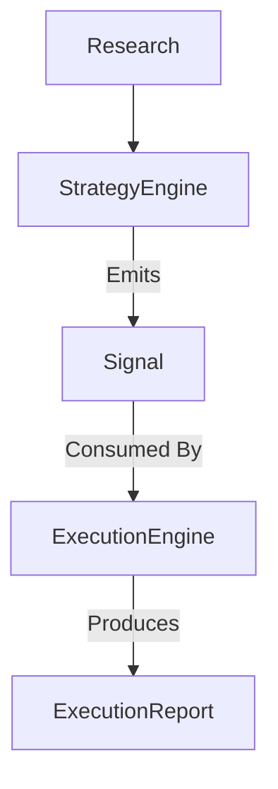

# Signal Specification

## 1. Purpose

The `Signal` is the core runtime contract representing actionable trading intent within the APEX Quant Research Framework. It is the **only** object emitted by a Strategy Engine.

The Simulation layer never receives strategy internals, logic, or private state. It only receives the `Signal`. This architecture guarantees complete decoupling between the decision-making process (Strategy) and the physical realities of trading (Simulation).

---

## 2. Lifecycle

The `Signal` sits strictly between the Strategy Engine and the Execution Engine in the unified workflow:

---

## 3. Signal Object Architecture

The `Signal` object encapsulates trading intent, organized into logical groups:

### 3.1 Identity
- `signal_id`: Unique cryptographic identifier for the signal instance.
- `strategy_name`: Identifier for the strategy generating the signal.
- `strategy_version`: Version tag ensuring reproducible traceability.
- `timestamp`: Exact simulated time of signal creation.

### 3.2 Direction
- `direction`: The intended market exposure (`LONG`, `SHORT`, or `NONE`). 

### 3.3 Entry
- `entry_type`: The desired entry mechanism (e.g., `MARKET`, `LIMIT`, `STOP`).
- `desired_entry`: The theoretical price point at which the strategy wishes to enter the market. 

### 3.4 Risk
- `risk_percent`: The percentage of portfolio equity to risk on this trade.
- `stop_loss`: The theoretical exit price to cap losses.
- `take_profit`: The theoretical exit price to secure gains.
- `trailing_stop`: The trailing threshold or logic parameter (if applicable).
- `max_holding_period`: Maximum time (in bars or seconds) the strategy intends to hold the position.

### 3.5 Confidence
- `confidence_score`: A probabilistic measure of the signal's expected success.
- `research_campaign`: The underlying research configuration from which this strategy was derived.
- `signal_strength`: Strategy-specific scalar representing the intensity of the trigger.
- `reason_code`: Enum or string identifying the exact structural reason for the signal.

### 3.6 Metadata
- `tags`: Arbitrary labels for downstream filtering and cohort analysis.
- `notes`: Human-readable context (primarily for debugging).
- `feature_snapshot_reference`: Link or hash to the exact feature state vector (from `TradingContext`) that triggered this signal.

---

## 4. Desired Entry vs. Actual Fill

A critical distinction in the APEX Framework is that a `Signal` represents **intent**, not reality.

The `Signal` specifies a `desired_entry`. It must **never** contain:
- `fill_price`
- `commission`
- `slippage`
- `profit`
- `execution_statistics`

Those metrics are exclusively physical properties of the market environment and belong in the `ExecutionReport`. A strategy dictates what it *wants* to happen; the execution engine reports what *actually* happened.

---

## 5. Rules of Ownership and Immutability

- **Who creates Signal:** The Strategy Engine.
- **Who consumes Signal:** The Execution Engine (or Simulation Runner).
- **Who may modify Signal:** Absolutely no one.
- **Immutability:** A `Signal` must be rendered strictly immutable immediately after instantiation.

---

## 6. Universality Across Methodologies

Because the `Signal` acts as a universal adapter, it homogenizes outputs across wildly different research paradigms.

- **Rule-based systems** map moving average crosses to a `LONG` Signal.
- **ML models** (like Random Forests) output class probabilities, transforming the highest probability into a `confidence_score` and `direction`.
- **Neural Networks** pass tensor outputs through an argmax layer to populate the `Signal`.
- **RL agents** translate abstract action spaces into physical `Signal` intents.
- **External APIs** can inject third-party signals (e.g., alternative data triggers) into the same pipeline.

Regardless of how the decision is made, the Execution Engine receives the exact same `Signal` object. The simulator processes the intent uniformly, entirely agnostic to whether the signal was generated by a complex transformer model or a simple heuristic.

---

## 7. Future Extensibility

The `Metadata` and `Confidence` blocks ensure that the `Signal` can evolve without breaking legacy Simulation components.
- As new risk paradigms emerge (e.g., volatility-adjusted dynamic sizing), the `Risk` block can be extended.
- By preserving the `feature_snapshot_reference`, researchers can retroactively analyze *why* a model generated a specific signal during an out-of-sample Walk Forward test, bridging the gap between Simulation and deep Analytics.

By strictly separating intent (`Signal`) from reality (`ExecutionReport`), APEX guarantees modular, institutional-grade robustness for all future research.
