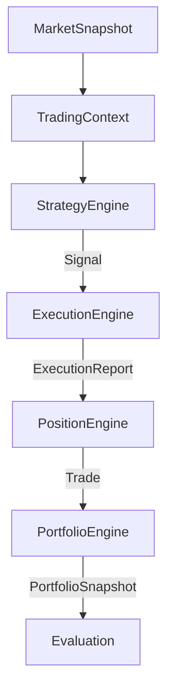
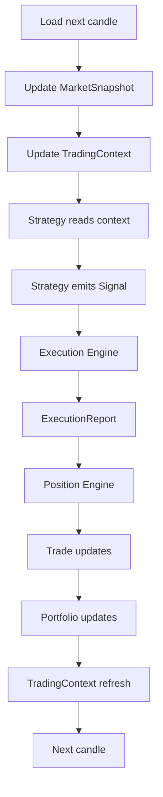

# APEX Simulation Framework Specification

## 1. Mission

Simulation validates whether research-backed trading ideas remain profitable under realistic execution and portfolio conditions.

- Simulation does **NOT** discover market edges.
- Simulation does **NOT** optimize strategies.
- Simulation validates executable strategies.

### Simulation Philosophy
- **Research asks:** "Does an edge exist?"
- **Strategy asks:** "How should we trade it?"
- **Simulation asks:** "What happens if we actually trade it?"

---

## 2. Architecture

The APEX Simulation pipeline acts as a strict state machine with absolute boundaries between responsibilities.



### Boundary Explanations and Ownership

1. **TradingContext Boundary:** `MarketSnapshot` builds the `TradingContext`. The Simulator owns the Context and updates it; the Strategy Engine only reads it.
2. **Execution Boundary:** The `StrategyEngine` emits a `Signal` (pure intent) to the `ExecutionEngine`. The Strategy Engine owns the Signal.
3. **Position Boundary:** The `ExecutionEngine` converts the `Signal` into an `ExecutionReport` (physical reality) and sends it to the `PositionEngine`. The Execution Engine owns the ExecutionReport.
4. **Portfolio Boundary:** The `PositionEngine` manages trade lifecycles and emits closed `Trade` objects to the `PortfolioEngine`. The Position Engine owns Trades.
5. **Evaluation Boundary:** The `PortfolioEngine` generates `Portfolio Snapshots` which are evaluated by Walk Forward and Monte Carlo engines.

Each module has exactly one responsibility. This ensures that failures, bugs, or complexity in one layer do not bleed into others. 

---

## 3. Modules

### 3.1 Execution Engine (`execution_engine.py`)
- **Receives:** `Signal`
- **Produces:** `ExecutionReport`
- **Responsible for:** Spread, slippage, commission, latency, partial fills, rejections.
- **Strictly nothing else.** No lifecycle management or PnL.

### 3.2 Position Engine (`position_engine.py`)
- **Receives:** `ExecutionReport`
- **Produces:** `Trade` (at close of lifecycle)
- **Responsible for:** Entry, exit, stop, target, holding period, trade lifecycle, R multiple.
- **Strictly nothing else.** No execution mechanics or portfolio-level stats.

### 3.3 Portfolio Engine (`portfolio_engine.py`)
- **Receives:** Completed `Trades`
- **Produces:** Portfolio snapshots
- **Responsible for:** Equity, balance, drawdown, exposure, margin, portfolio statistics.
- **Strictly nothing else.** No individual position stops or execution mechanics.

### 3.4 Walk Forward Engine (`walkforward_engine.py`)
- **Responsible only for:** Rolling validation, train/test windows, stability, generalization.
- **Strictly no optimization.**

### 3.5 Monte Carlo Engine (`monte_carlo_engine.py`)
- **Responsible only for:** Trade reshuffling, random execution ordering, confidence intervals, drawdown distributions, risk analysis.

---

## 4. Object Lifecycle

The progression of data through the simulator represents the lifecycle of a trading idea materializing into empirical history.

`Signal` ➔ `ExecutionReport` ➔ `Trade` ➔ `Portfolio Snapshot`

1. **Signal:** Created by Strategy Engine when conditions are met. Becomes immutable instantly. Archived into strategy logs.
2. **ExecutionReport:** Created by Execution Engine immediately upon processing a Signal. Immutable instantly upon fill/reject. Archived into execution logs.
3. **Trade:** Created by Position Engine upon entry. Remains mutable while open (e.g., updating floating PnL, trailing stops). Becomes immutable exactly when the position is closed. Archived into the trade ledger.
4. **Portfolio Snapshot:** Created by Portfolio Engine after processing end-of-bar or end-of-day updates. Immutable instantly. Archived into portfolio equity curves.

---

## 5. Simulation Loop

A single simulation timestep guarantees strict temporal progression without look-ahead bias.



### Avoiding Look-Ahead Bias
This loop is strictly sequential. The Strategy reads a state that represents the *open* or *close* of a bar, but the Execution Engine resolves the resulting `Signal` against subsequent ticks or the *next* bar's prices. State updates always lag the physical clock, perfectly mirroring a live environment.

---

## 6. Reporting

The Simulation run must generate the following deterministic directory structure and artifacts:

```text
simulation/
└── run_xxxx/
    ├── Execution/
    ├── Trades/
    ├── Portfolio/
    ├── WalkForward/
    ├── MonteCarlo/
    ├── summary.json
    ├── Simulation_Report.md
    └── Simulation_Report.html
```

---

## 7. Design Principles

Simulation must:
- Be deterministic.
- Be reproducible.
- Be modular.
- Be broker-independent.
- Be strategy-independent.
- Be read-only with respect to Research and Analytics.
- Contain no hidden state.
- Contain no circular dependencies.

---

## 8. Non-Responsibilities

Simulation must **NOT**:
- Perform feature engineering.
- Perform analytics.
- Perform research.
- Perform optimization.
- Train ML models.
- Change strategy parameters.
- Discover new edges.

---

## 9. Failure Isolation

Every engine must fail independently. Following the same resilience philosophy as the Doctor framework:
- Execution failure must not corrupt Portfolio records.
- WalkForward failure must not invalidate Trade history.
- MonteCarlo failure must not stop Portfolio generation.

---

## 10. Simulation Phase Roadmap

Implementation order for the APEX Simulation Phase:

- **Sprint 1:** Execution Engine
- **Sprint 2:** Position Engine
- **Sprint 3:** Portfolio Engine
- **Sprint 4:** WalkForward
- **Sprint 5:** Monte Carlo
- **Sprint 6:** Simulation Doctor
- **Sprint 7:** Simulation Validation

---

## 11. Conclusion

Simulation becomes the unbreakable bridge between Research and Strategy Engineering. By stringently isolating logic, Execution, Positioning, and Portfolio tracking into singular responsibilities connected by immutable contracts, APEX ensures that if a strategy is profitable in Simulation, the results can be trusted entirely as empirical fact, ready for live market deployment.
