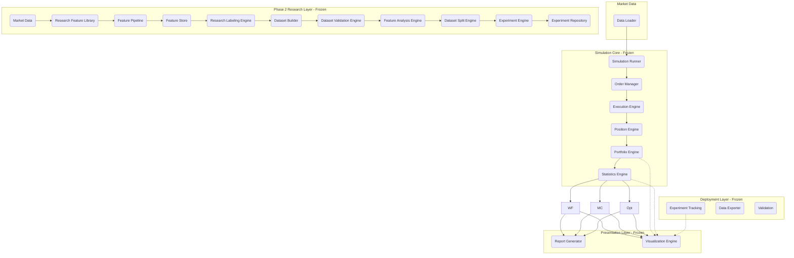

# APEX System Architecture

This document describes the high-level architecture and dependencies of the APEX framework.

## Core Architectural Principle
**Presentation Layer performs:**
- **NO calculations**
- **NO simulations**
- **NO optimization**
- **NO statistical processing**
*The Presentation Layer is strictly read-only.*

---

## Dependency Graph

## Visualization Engine Connections
The **Visualization Engine** is exclusively connected to immutable DTOs:
- `PortfolioSnapshot`
- `StatisticsSummary`
- `WalkForwardResult`
- `MonteCarloResult`
- `OptimizationResult`
- `ExperimentRecord`
