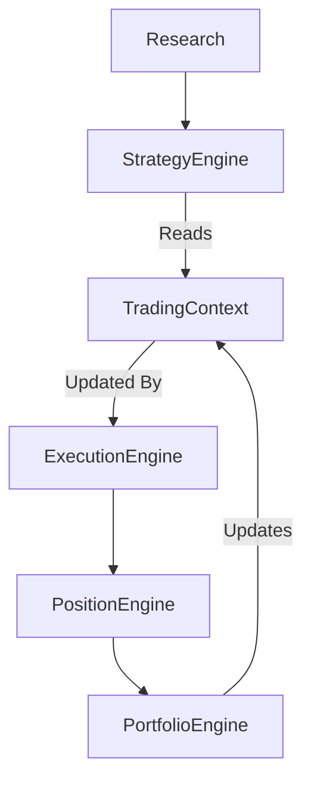

# TradingContext Specification

## 1. Purpose

`TradingContext` is the single, unified shared runtime state object exchanged between the Strategy layer and the Simulation layer. 

Its primary purpose is to **eliminate direct coupling**. 

In the APEX Quant Research Framework, the Strategy Engine must never communicate directly with the:
- Execution Engine
- Position Engine
- Portfolio Engine
- Walk Forward Engine

Instead, the Strategy reads the `TradingContext`. The Simulation layer updates the `TradingContext`. To the Strategy Engine, `TradingContext` is strictly **read-only**.

---

## 2. Architecture

`TradingContext` sits at the exact boundary between decision-making and execution:

### Why this is NOT a feedback loop
A feedback loop implies direct, continuous mutual interference between decision logic and state generation. Here, the flow is strictly unidirectional:
1. The Simulation Engines update the `TradingContext` to reflect reality.
2. The Strategy Engine evaluates the `TradingContext` at a discrete point in time and outputs theoretical Orders.
3. The Strategy hands Orders off and cedes all control back to Simulation. 
The Strategy cannot adjust the Context, and the Simulator does not make trading decisions.

### Why Strategy must never access simulator internals
If the Strategy accesses the Execution Engine or Position Engine directly, it becomes coupled to the simulation environment. This risks look-ahead bias, curve-fitting to simulation mechanics, and prevents the strategy from being seamlessly ported to live trading or different backtesting engines. By forcing the Strategy to look only at `TradingContext`, we guarantee environmental agnosticism.

---

## 3. Contents

The `TradingContext` object organizes runtime state into logical groups:

### 3.1 Clock
- `timestamp`: Current simulated datetime.
- `bar_index`: Current index in the historical timeseries.
- `session`: Active trading session (e.g., Asian, London, New York).
- `day_of_week`: Current day of the week.
- `market_open`: Boolean indicating if the market is actively trading.

### 3.2 Market
- `current_price`: Latest available price (Bid/Ask or Last).
- `spread`: Current market spread.
- `volatility_regime`: Classified volatility state (e.g., low, normal, high).
- `trend_regime`: Classified trend state (e.g., ranging, trending).
- `market_structure`: Higher-level structure identifiers.
- `atr`: Current Average True Range.

### 3.3 Portfolio
- `equity`: Total portfolio equity (balance + floating PnL).
- `balance`: Realized account balance.
- `floating_pnl`: Unrealized Profit/Loss of open positions.
- `closed_pnl`: Realized Profit/Loss of closed positions.
- `drawdown`: Current drawdown from peak equity.
- `daily_pnl`: Realized Profit/Loss for the current trading day.
- `max_drawdown`: Maximum drawdown recorded so far.

### 3.4 Exposure
- `open_positions`: Count of currently open positions.
- `long_positions`: Count of open long positions.
- `short_positions`: Count of open short positions.
- `net_exposure`: Total net exposure (Longs - Shorts).
- `margin_used`: Total margin locked by open positions.
- `available_margin`: Free margin available for new positions.

### 3.5 Risk
- `daily_loss_limit_hit`: Boolean flag if the daily loss limit has been breached.
- `risk_enabled`: Boolean flag indicating if new risk can be taken.
- `max_positions_reached`: Boolean flag if the maximum allowed open positions limit is reached.
- `trading_paused`: Boolean flag if trading is administratively paused (e.g., around major news events).

### 3.6 Execution
- `last_fill_price`: Execution price of the most recent fill.
- `last_slippage`: Slippage incurred on the most recent trade.
- `last_commission`: Commission paid on the most recent trade.
- `last_trade_time`: Timestamp of the most recent execution.

---

## 4. Rules

- **Ownership:** The Simulation Layer (specifically the Simulation Runner or a dedicated Context Manager) owns the `TradingContext`.
- **Who updates it:** Only the Simulation Engines (Execution, Position, Portfolio) are permitted to update its fields.
- **Who can read it:** The Strategy Engine.
- **Who cannot modify it:** The Strategy Engine is strictly forbidden from modifying any field within `TradingContext`.

---

## 5. Design Principles

The `TradingContext` object must adhere to the following principles:
- **Deterministic:** The same inputs must always produce the exact same Context state.
- **Immutable to Strategy:** Passed as a frozen, read-only object to the Strategy Engine.
- **Independent of MT5:** Contains no MetaTrader-specific terminology or structures.
- **Independent of broker APIs:** Agnostic to FIX, REST, or websocket payloads.
- **No trading logic:** It is purely a state container.
- **No optimization:** Does not store parameters being optimized.
- **No research conclusions:** Strictly runtime state, not a repository for historical analysis.

---

## 6. Non-Responsibilities

`TradingContext` is a passive state transfer object. It must **NOT**:
- Generate signals
- Make trading decisions
- Optimize parameters
- Execute trades
- Calculate analytics
- Perform research

---

## 7. Future Extensibility

Because `TradingContext` is a standardized, purely descriptive state snapshot, it acts as a universal input vector. 

Future Strategy Engines can consume it without any modification to the simulation framework:
- **Rule Based Systems:** Evaluate simple conditionals against `current_price` and `atr`.
- **Machine Learning (e.g., Random Forests):** Use the context fields as inference features.
- **Reinforcement Learning:** Treat the `TradingContext` directly as the environment `state` (S) for an agent observing the environment.
- **Neural Networks:** Normalize the `TradingContext` array into an input tensor.

All strategy archetypes require the same fundamental knowledge of "what is happening right now." `TradingContext` provides exactly that.

---

## 8. Conclusion

`TradingContext` becomes one of the fundamental contracts of the APEX architecture, taking its place alongside:
- `MarketSnapshot`
- `Signal`
- `Trade`
- `Position`
- `Portfolio`
- `AnalyticsResult`
- `ResearchResult`

By defining runtime state as an explicit contract, we ensure that strategies and simulators can evolve entirely independently, fulfilling the core goal of a modular, institutional-grade quantitative research framework.
