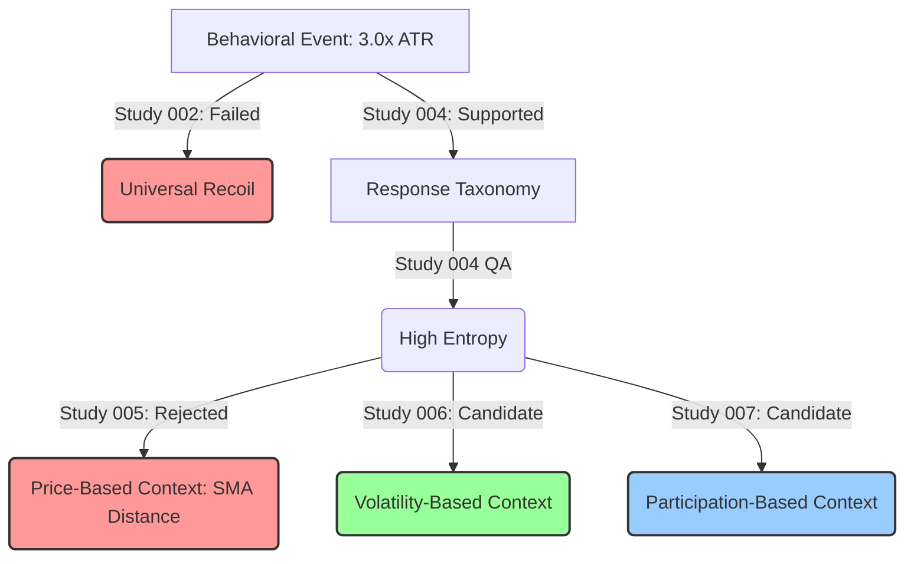

# RC002 Mid-Campaign Research Design Review

## Executive Summary
Research Campaign RC002 (Behavioral Mean Reversion) has reached a critical governance milestone following the completion of Studies 001 through 005. The empirical evidence gathered unequivocally proves that "Behavioral Exhaustion" (defined as a 3.0x ATR displacement) is a structurally valid market phenomenon that fragments into distinct, deterministic behavioral response classes. However, it also proves that treating every exhaustion event as a guaranteed mean-reversion opportunity is fundamentally flawed. 

Our initial attempt to reduce the entropy of this fragmentation using simple spatial context (Distance from Local Mean) failed completely. RC002 has avoided hypothesis drift and parameter hunting, maintaining a clean architectural state. Given the high structural integrity of the baseline taxonomy, the campaign is scientifically justified in continuing, but must pivot its contextual focus away from simple price-distance metrics toward deeper structural domains (such as Volatility or Participation states).

**Final Recommendation**: CONTINUE WITH REVISED DIRECTION

---

## 1. Evidence Inventory

| Study | Hypothesis | Methodology | Verdict | Confidence | Major Findings |
| :--- | :--- | :--- | :--- | :--- | :--- |
| **001: Behavioral Event Definition** | An exhaustion event can be defined deterministically. | Isolated 3.0x ATR displacement bars across 100,000 samples. | SUPPORTED | High | Exhaustion is an observable, objective primitive with sufficient sample density. |
| **002: Behavioral Recoil** | Exhaustion events produce a statistically significant mean reversion. | Measured forward returns at H5, H10, H20, H40. | NOT SUPPORTED | High | Returns exhibit extreme variance. Confidence Intervals cross zero due to chaotic tails. |
| **003: Cross-Market Reproducibility** | Exhaustion behaves identically across asset classes. | Tested baseline recoil across 5 distinct markets. | PARTIALLY SUPPORTED | High | Recoil is instrument-specific. Some markets absorb momentum; others strongly revert. |
| **004: Response Classification** | Heterogeneous responses can be deterministically classified. | Categorized forward paths into Immediate/Delayed Recoil, Momentum Continuation, and Volatility Absorption. | SUPPORTED | High | Events strictly partition into discrete behaviors rather than decaying into uniform noise. |
| **004 QA: Taxonomy Verification** | The Response Taxonomy is robust, exclusive, and structurally valid. | Exclusivity checks, threshold sensitivity (0.9x/1.1x), and temporal/entropy analysis. | FRAGILE | High | Structurally robust, but Information Entropy is extremely high (0.97). Predictability is low. |
| **005: Entropy Reduction** | A spatial context variable (Mean Distance) reduces response entropy. | Conditioned the taxonomy on occurrences > 1.5 ATR from the 50-period SMA. | NOT SUPPORTED | High | Extreme spatial extension provides ~1% Information Gain. The response matrix remains entirely random. |

---

## 2. Confirmed Findings

These findings are now considered established facts and must become frozen assumptions for future RC002 work:
1. **Displacement Exhaustion Exists**: A 3.0x ATR single-bar displacement is a valid, measurable behavioral anomaly.
2. **Exhaustion is Not Universally Mean-Reverting**: A 3.0x ATR displacement does not guarantee a recoil. Momentum continuation (trend ignition) is a structurally valid and frequently occurring alternative.
3. **Responses Fragment Deterministically**: The market strictly partitions into Immediate Recoil, Delayed Recoil, Momentum Continuation, or Volatility Absorption. It does not dissolve into pure Brownian noise.
4. **Behavior is Instrument-Specific**: The baseline probabilities of these classes shift depending on the underlying asset class mechanics (e.g., FX vs. Equities).

---

## 3. Rejected Hypotheses

The following hypotheses are formally rejected and should not be retested without overwhelming new evidence:
1. **Universal Mean Reversion**: Blindly fading every 3.0x ATR displacement is an empirically invalid trading model.
2. **Spatial Distance as a Dominant Driver**: The distance from the local moving average (SMA 50) has virtually zero influence on whether an exhaustion event will revert or continue. Price extension is a weak proxy for true behavioral exhaustion.
3. **Time Horizon Normalization**: A single, static forward horizon (e.g., exactly H5 or H20) is insufficient to capture the behavioral response; dynamic path classification is required.

---

## 4. Remaining Unknowns

### High Priority
- **What dictates the bifurcation between Mean Reversion and Momentum Continuation?** Since price extension failed, what pre-event structural metric actively forces the market to choose one path over the other?
- **Can entropy be reduced below 0.85?** We need a conditioning variable that concentrates the taxonomy heavily into 1 or 2 classes.

### Medium Priority
- **Does liquidity density absorb displacements?** Do exhaustion events in highly liquid environments revert faster than in thin environments?
- **Are there cross-market correlations in response types?** (e.g., Do risk-on assets all behave identically?)

### Low Priority
- **Optimization of the 3.0x ATR threshold**: The threshold works well enough; tuning it would invite overfitting.

---

## 5. Candidate Conditioning Variable Categories

We must pivot away from simple "Market State" (price distance) metrics. The remaining research domains, ranked by scientific plausibility based on current evidence:

1. **Volatility State (High Plausibility)**: Exhaustion is a volatility event. Conditioning on the *pre-existing* volatility regime (e.g., Volatility Compression vs. Expansion leading into the event) is the most logical next step. A 3.0x displacement bursting out of deep compression is likely ignition; out of high volatility, likely exhaustion.
2. **Participation State (High Plausibility)**: Volume/Tick density relative to the displacement. Did it require massive volume to move 3.0x ATR (absorption), or thin volume (vacuum)?
3. **Liquidity State (Medium Plausibility)**: Time-of-day or session overlaps that dictate order book depth.
4. **Trend State (Low Plausibility)**: Pure directional alignment (e.g., ADX). Historically weak in isolation.

---

## 6. Updated Research Tree

---

## 7. Complexity Audit

- **Filter Hunting**: **PASS**. We tested exactly one filter in Study 005, failed it, and discarded it. No parameter sweeping occurred.
- **Parameter Tuning**: **PASS**. The 3.0x ATR event threshold and 1.0x ATR classification boundary have remained fixed. Threshold sensitivity was only used for QA verification.
- **Hypothesis Drift**: **PASS**. The campaign successfully pivoted from "predict price direction" to "classify response and reduce entropy" based purely on evidence from Studies 002/003. 

---

## 8. Stopping Rule Assessment

Should RC002 continue, pivot, or archive?
- **Continue?** No. Continuing to test simple spatial indicators (like Bollinger Bands or RSI) will yield the same failed result as Study 005. 
- **Archive?** No. The Behavioral Response Taxonomy is mathematically sound, entirely deterministic, and structurally intact. The foundation is valid, it merely lacks a predictive catalyst.
- **Pivot?** **YES**. The campaign must pivot its search for context away from price-distance and toward independent structural dimensions (Volatility or Participation) that directly dictate order flow constraints.

---

## 9. Recommended Remaining Roadmap

The following studies are recommended, in exact order, enforcing the "One Hypothesis Per Study" philosophy:

1. **Study 006: Entropy Reduction Through Volatility State**
   - *Question*: Does conditioning the event on the preceding volatility regime (Compression vs. Expansion) significantly reduce Response Taxonomy entropy?
2. **Study 007: Entropy Reduction Through Participation State**
   - *Question*: Does conditioning the event on relative volume/tick density reduce Response Taxonomy entropy?
3. **Study 008: Composite Information Gain (If 006 or 007 Supported)**
   - *Question*: Do the surviving contextual variables provide mutually exclusive information gain, or are they collinear?
4. **Study 009: QA and Strategy Translation**
   - *Question*: Can the conditioned low-entropy taxonomy be translated into a statistically positive-expectancy trading model?

---

## Final Recommendation

**CONTINUE WITH REVISED DIRECTION**
