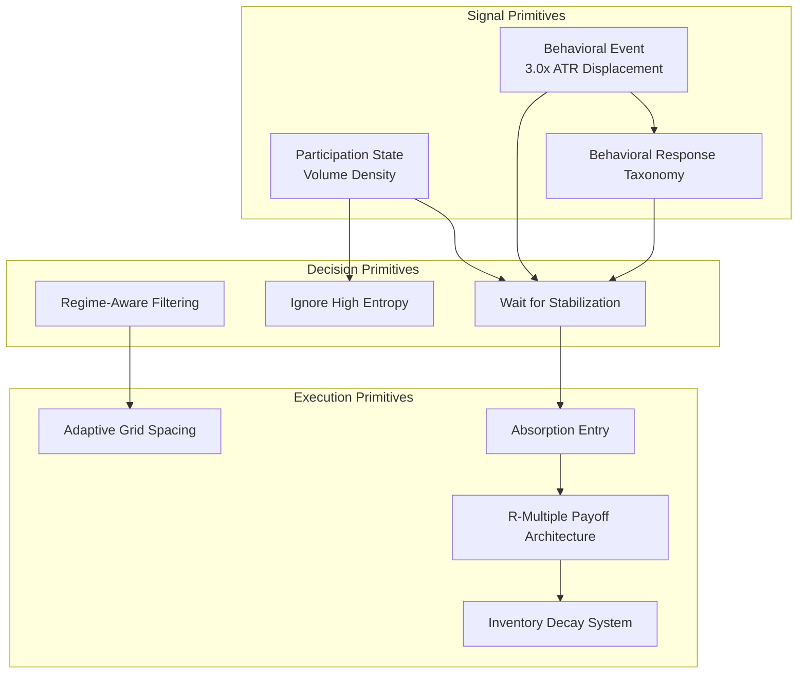

# RC003 Primitive Catalog: Decision Primitive Decomposition

## Scientific Objective
To formally identify and classify every validated research output accumulated across the project's history into Signal Primitives, Decision Primitives, and Execution Primitives, establishing the complete behavioral vocabulary available to the future execution engine.

---

## Signal Primitives

*Observations about the market. A signal primitive never says what to do.*

| Primitive Name | Campaign | Study (Evidence) | Validation Status | Dependencies | Current Usage |
| :--- | :--- | :--- | :--- | :--- | :--- |
| **Behavioral Event (3.0x ATR Displacement)** | RC002 | RC002 Study 001 / QuantForge Phase 1 | Validated | None | Frozen |
| **Behavioral Response Taxonomy** | RC002 | RC002 Study 004 | Validated | Behavioral Event | Frozen |
| **Participation State (Volume Density)** | RC002 | RC002 Study 007 | Validated | None | Frozen |
| **Gradual Expansion (Path Dependency)** | RC002 | RC002 Study 010 | Validated | None | Production Candidate |
| **Deep Z-Score Displacement** | Pre-Apex | QuantForge Phase 2 | Validated | None | Production Candidate |
| **Post-Panic Persistence (Recoil Stabilization)** | Pre-Apex | QuantForge Phase 6 | Validated | Behavioral Event, Recoil | Production Candidate |
| **Institutional Liquidity Sweep** | RC001 | RC001 Study 001-006 | Rejected | None | Unused |
| **Spatial Context (Mean Distance)** | RC002 | RC002 Study 005 | Rejected | Behavioral Event | Unused |
| **Pre-event Volatility State** | RC002 | RC002 Study 006 | Rejected | Behavioral Event | Unused |
| **Structural Context (Range Position)** | RC002 | RC002 Study 008 | Rejected | Behavioral Event | Unused |
| **Behavioral Archetypes (Momentum)** | RC002 | RC002 Study 009 | Rejected | Behavioral Event | Unused |

---

## Decision Primitives

*Rules that decide whether action should be taken. They transform observations into choices.*

| Primitive Name | Campaign | Study (Evidence) | Validation Status | Dependencies | Current Usage |
| :--- | :--- | :--- | :--- | :--- | :--- |
| **Wait (For Price Stabilization)** | RC002 | RC002 Study 012 | Validated | Participation State, Behavioral Event | Frozen |
| **Regime-Aware Filtering (Danger Scoring)** | Pre-Apex | Pre-Apex Phase 4-5 | Validated | Baseline Deviation | Production Candidate |
| **Virtual Signal Confirmation** | Pre-Apex | QuantForge Phase 5-6 | Validated | Deep Z-Score Displacement | Production Candidate |
| **Ignore (High Entropy State)** | RC002 | RC002 Study 007 | Validated | Participation State | Frozen |

---

## Execution Primitives

*How the order is actually executed. Execution primitives never create signals.*

| Primitive Name | Campaign | Study (Evidence) | Validation Status | Dependencies | Current Usage |
| :--- | :--- | :--- | :--- | :--- | :--- |
| **Absorption Entry (Policy C)** | RC002 | RC002 Study 012 | Validated | Wait Decision, Stabilization | Frozen |
| **R-Multiple Payoff Architecture** | Pre-Apex | Pre-Apex Phase 7 | Validated | Inventory Scaling | Frozen |
| **Inventory Decay System (Aging Exits)** | Pre-Apex | Pre-Apex Phase 9 | Validated | R-Multiple Payoff | Frozen |
| **Adaptive Grid Spacing / Tapered Exposure** | Pre-Apex | Pre-Apex Phase 2 | Validated | Regime-Aware Filtering | Frozen |
| **Adaptive ATR Target Exit** | Pre-Apex | QuantForge Phase 4 | Validated | Absorption Entry | Production Candidate |
| **Trailing Stops / Breakeven Logic** | Pre-Apex | QuantForge Phase 4 | Rejected | Any Entry | Unused |

---

## Dependency Graph

---

## Missing Primitives

The following capabilities are required for a production trading engine but are currently absent from the validated knowledge base:

1. **Dynamic Normalization:** The ability to dynamically scale thresholds (e.g., ATR and Volume Percentiles) per asset to prevent edge collapse outside of EURUSD (as identified in RC002 Study 013).
2. **Position Sizing Decision:** A primitive deciding how much capital or risk percentage to allocate per individual entry, given the current regime.
3. **Multi-Signal Arbitration:** Logic to resolve conflicts when multiple valid Signal Primitives trigger simultaneously (or contradict each other).
4. **Confidence Estimation:** A primitive that aggregates multiple contextual signals (like path dependency + participation state) into a unified conviction score.
5. **Risk Budget Allocation:** Portfolio-level mechanics governing exposure limits across multiple concurrent instruments or correlated pairs.
6. **Slippage & Friction Translation:** While execution delay was tested, there is no formal execution primitive mapping simulated signals to realistic MT5 slippage constraints during extreme flash-events.
